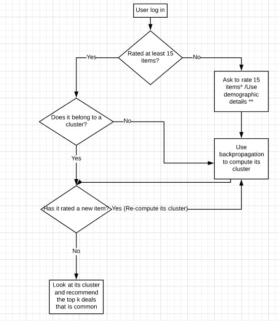

# Models for deal recommendation

This project is simply a collection of models used for a recommendation system. It is a part of my research study from freshman year in college. 

The workflow used for the project was:

It is an extension of the web crawling project from the same year. The web crawler would scrape the website https://www.dealnews.com/ and fetch all the deals and classify them into categories. 

The recommendation system would then use the details about those deals to recommend it to users. A hybrid method using Collaborative Filtering and Content-based filtering was studied for this project. 